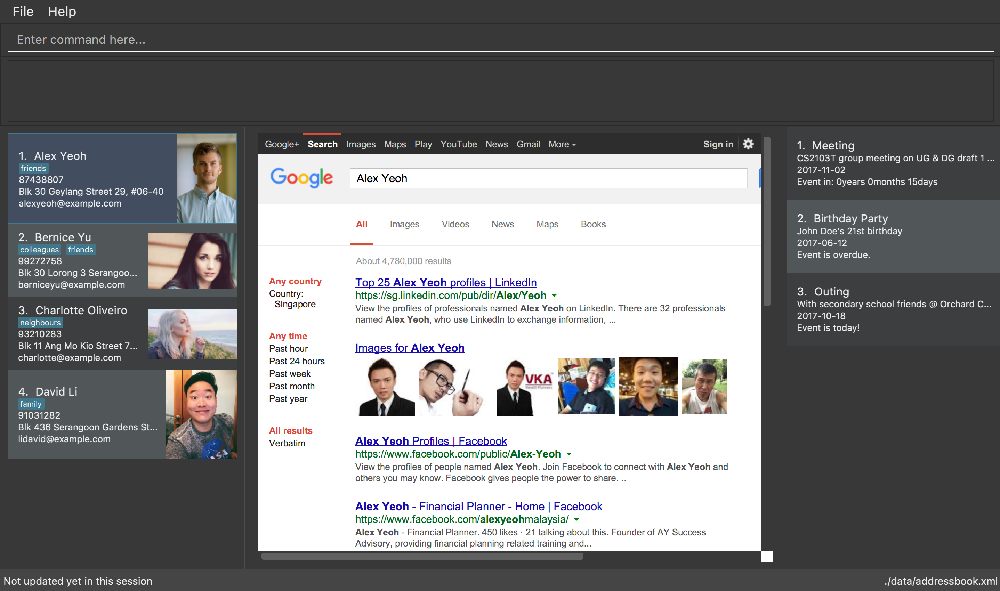

= Directory of Contacts (DoC) v1.5
ifdef::env-github,env-browser[:relfileprefix: docs/]
ifdef::env-github,env-browser[:outfilesuffix: .adoc]

https://travis-ci.org/CS2103AUG2017-T11-B1/main[image:https://travis-ci.org/CS2103AUG2017-T11-B1/main.svg?branch=master[Build Status]]
https://coveralls.io/github/CS2103AUG2017-T11-B1/main?branch=master[image:https://coveralls.io/repos/github/CS2103AUG2017-T11-B1/main/badge.svg?branch=master[Coverage Status]]

ifdef::env-github[]

endif::[]

ifndef::env-github[]
image::images/Ui.png[width="600"]
endif::[]

* DoC is a java based desktop application. User interactions are built to be CLI (Command Line Interface) based, but it has a GUI.
* DoC is intended to be the optimal solution for users' to manage their contacts.

== Site Map

* <<UserGuide#, User Guide>>
* <<DeveloperGuide#, Developer Guide>>
* <<AboutUs#, About Us>>
* <<ContactUs#, Contact Us>>

== Acknowledgements

* DoC is adapted from se-edu's addressbook-level4: https://github.com/se-edu/addressbook-level4, and was developed as part of a CS project in NUS

* Some parts of this sample application were inspired by the excellent http://code.makery.ch/library/javafx-8-tutorial/[Java FX tutorial] by
_Marco Jakob_.

== Licence : link:LICENSE[MIT]
